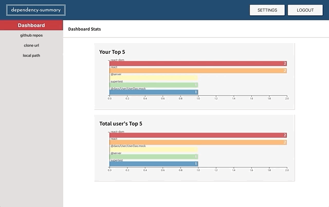
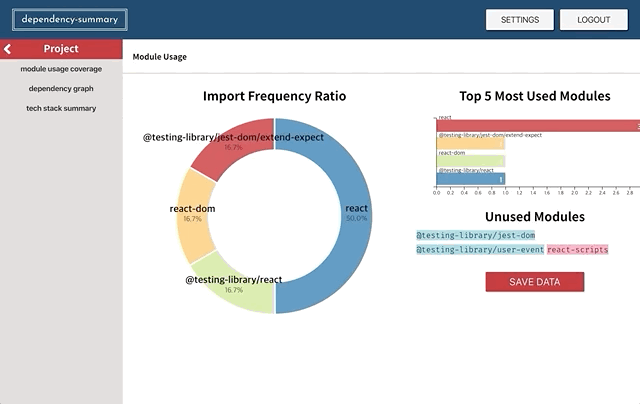
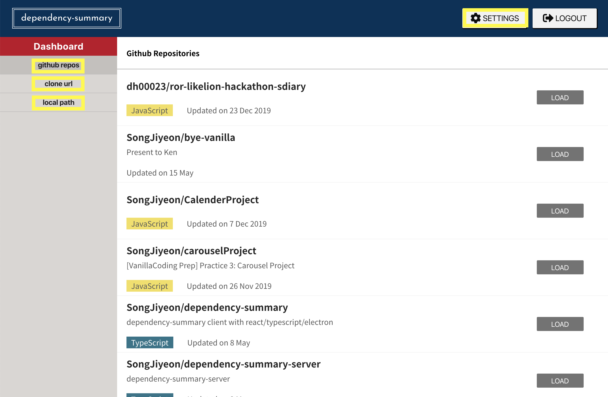
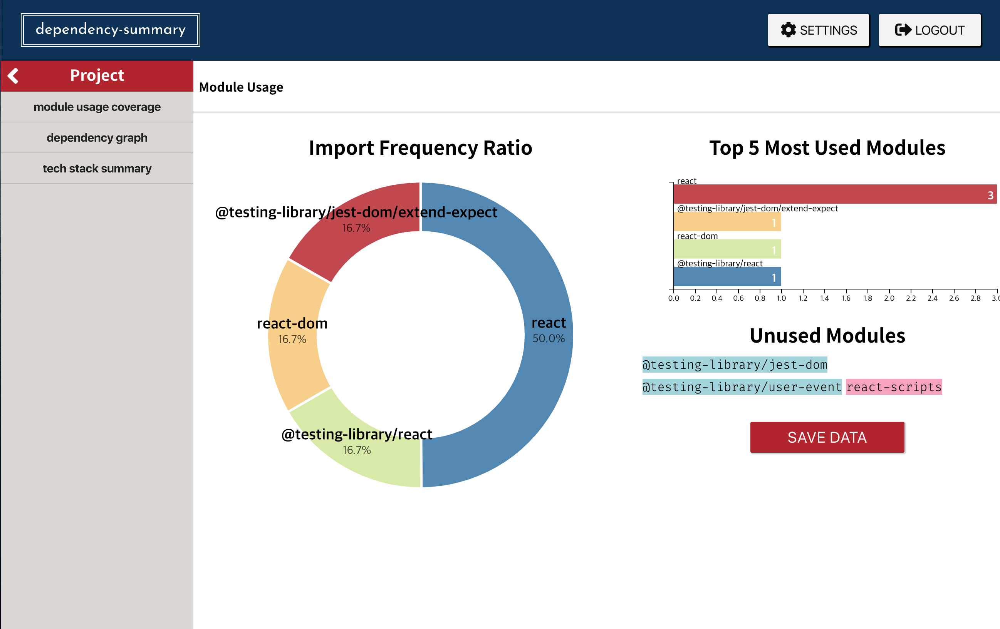
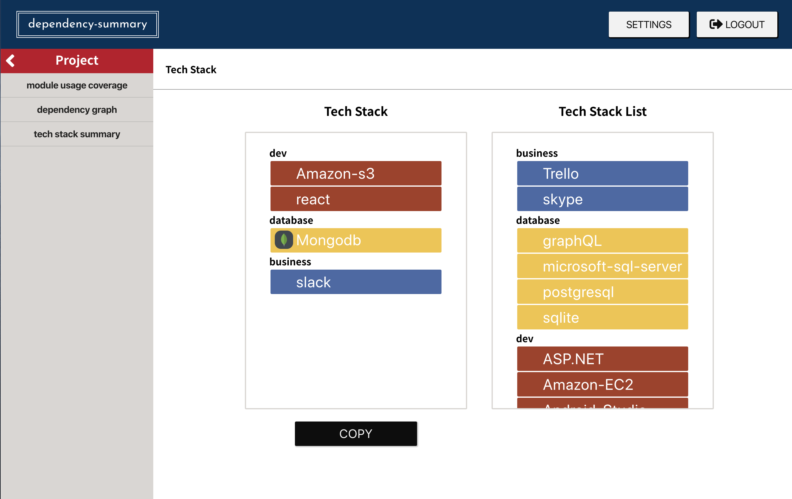

# Dependency Summary

---


## List

- Introduction
- Tech/tool Stack
- Installation
- Usage
- Difficulties


## Introduction

---

Dependency Summary는 프로젝트의 dependency를 요약, 시각화하는 데스크탑 앱입니다. 

### 기능 요약

- Module Usage Summary
  - 프로젝트의 module usage를 pie graph로 요약 및 시각화
  - 가장 많이 사용한 module top 5를 bar graph로 시각화
  - package.json에서 import/require되지 않은 module 표기

​																			**Module Usage Summary**




- Dependency Graph
  - package.json의 module dependency를 graph로 표현
  - 위 그래프를 module dependency의 depth에 따라 표현

​																				**Dependency Graph**




- Tech Stack
  - package.json기반의 사용된 주요 기능을 표기
  - 필요한 tech stack을 리스트에 추가/삭제
  - 표기된 tech stack을 html 형태로 클립보드에 저장

​																						**Tech Stack**


## Tech/tool Stack

---

### 준비단계

- Balsamiq Wireframes: Mock up tool

### 개발단계

- React
- Redux
- React-redux
- Electron
- D3.js
- Node.js
- Express


## Installation

---

아래 명령어를 통해 프로젝트를 직접 실행할 수 있습니다

```
git clone https://github.com/SongJiyeon/dependency-summary.git
npm install
npm run electron-start
```


## Usage

---

### 시작하기



- github repos

  - **로그인한 사용자의 github repository를 불러옵니다**
  - repository 우측의 'LOAD' 버튼을 누르면 설정된 장소(사용자 설정 주소가 없다면 documents 폴더 아래의 .ds 폴더)에 해당 repository가 git clone, npm install 됩니다
  - npm install이 끝난 후에는 npm list 명령어를 통해 module dependency 데이터를 json으로 저장합니다 (파일명: npmlist.json)

- clone url

  - **clone할 github url을 직접 입력합니다**
  - 입력된 url의 git repository가 clone, npm install 됩니다
  - npm install이 끝난 후에는 npm list 명령어를 통해 module dependency 데이터를 json으로 저장합니다 (파일명: npmlist.json)

- local path

  - **사용자의 로컬 저장소에 있는 프로젝트 폴더를 직접 접근합니다**
  - node_modules가 없는 경우, npm install을 진행합니다
  - npmlist.json이 없는 경우, npm list 명령어를 통해 module dependency 데이터를 저장합니다

- SETTINGS

  - github repos/clone url을 통해 저장될 프로젝트의 위치를 default location(documents 아래의 .ds 폴더)가 아닌 사용자 지정 경로로 변경할 수 있습니다

    



- Import Frequency Ratio
  - package.json에 있는 모듈 중 프로젝트에 import/require 된 모듈 비율을 보여줍니다
- Top 5 Most Used Modules
  - 위 모듈 중 가장 많이 사용된 top 5 모듈과 사용 빈도를 보여줍니다
- Unused Modules
  - package.json에 있지만 import/require 되지 않은 모듈을 보여줍니다
  - 사용 가능성이 있는 scope dependency는 파란색, dev dependency는 초록색으로 표시됩니다
  - scope/dev가 아닌 경우 빨간색으로 표시됩니다


- WEIGHT
  - depend 정도에 따라 많이 의존될 수록 원의 중심에 위치합니다
  - 노드(모듈)에 마우스를 올리면 해당 모듈을 의존하고 있는 관련 노드와 연결 링크가 강조됩니다
- DEPTH
  - depend의 depth(프로젝트의 package.json에 가까운 정도)에 따라 순서대로 위치합니다




- Tech Stack
  - package.json에 표기된 모듈 중 주요 기능을 표기합니다
  - 우측 Tech Stack List에서 필요한 Stack을 추가할 수 있습니다
- Tech Stack List
  - 추가 가능한 tech stack의 목록입니다
- COPY
  - 선택한 Tech Stack을 정리해서 보여줍니다
  - 'COPY'버튼을 통해 정리된 tech stack을 클립보드에 저장할 수 있습니다


## Difficulties

---

✅ 해결된 케이스 ❓미해결 케이스

electron, d3.js를 포함하여 잘 알지못하는 기술을 접하면서 발생하는 문제들이 있었습니다. 작은 문제일지라도 해결 방법과 남은 문제의 기록을 통해 추후 참고하고 프로젝트를 개선하고자 합니다.

- **✅ 사용자의 프로젝트를 검사하는 과정**

  - 사용자의 프로젝트를 검사할 때 서버에서 접근/진행하기에 무리가 있었습니다. 전체 프로젝트에 대한 npm install을 진행해야 npm list로 dependency 데이터를 확인할 수 있었고, 프로젝트 전체 js/ts 파일을 babel과 esprima로 검사해야했습니다.
  - 이 부분에 대한 해결방법으로 electron을 알게되었습니다. 데스크탑 앱으로 만들면 사용자의 local에 접근해서 서버를 사용하지 않고 위 과정을 진행할 수 있었습니다.
  - ❕**Electron**: github이 운영하는 오픈 소스 프레임워크로 html, css, javascript를 통해 웹과 데스크탑 앱으로 모두 사용할 수 있는 크로스 플랫폼 앱을 만들 수 있습니다

- ✅ electron의 dialog 사용하기

  - 사용자의 로컬에 접근해서 파일을 읽고 쓰기위해 `dialog()`를 사용해야했지만 접근이 되지 않았습니다.

  - 이유는 electron을 require를 통해 직접 사용할 수 있는 곳은 renderer가 아닌 외부 main 파일로, 외부의 electron을 remote를 통해 접근해야했습니다.

    ```javascript
    // main
    const { dialog } = require('electron');
    
    // renderer
    import electron from 'electron';
    const { dialog } = electron.remote;
    
    // or
    
    const { dialog } = require('electron').remote;
    ```

- ✅ dialog 사용 시 `fs.existsSync is not a function`에러가 발생

  - `rescripts` 모듈 설치를 통해 package.json의 scripts를 `start: rescripts start`로 수정하여 해결하였습니다
  - ❓하지만 정확한 원인을 아직 파악하지 못했습니다

- ✅ d3.js force graph(dependency graph)의 버전 변경(weight -> depth)가 제대로 되지 않는 문제

  - 버전 변경 시, 이전 기록이 남아있는 것 처럼 그래프가 제대로 변경되지 않는 문제가 있었습니다
  - 해당 문제의 원인은 데이터의 shallow copy 문제로 그래프를 그리면서 정제한 데이터가 직접 변경되면서 다시 depth 그래프를 그리더라도 weight에서 정제한 데이터가 적용되어서 생긴 문제였습니다.
  - lodash의 `_.cloneDeep()`을 통해 복사한 데이터를 d3가 사용할 수 있게 했고, 그래프를 그릴때마다 새로운 데이터를 그래프에 맞게 정제해서 사용할 수 있었습니다.

  

